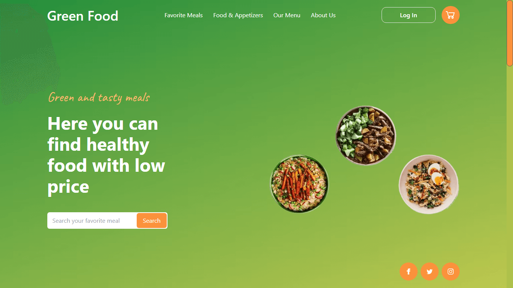

# Green Food Fictional Restaurant

Landing Page for a fictional restaurant.

## Techs & Tools:

<ul>
  <li>HTML</li>
  <li>TailwindCSS (and a bit of CSS)</li>
  <li>JavaScript</li>
  <li>Git</li>
  <li>TinyPNG (for image compression)</li>
</ul>

*This project was inspired by this template on Figma: **[click here](<https://www.figma.com/file/m5YxS94r1o1HTmB1bETkSn/Restaurant-UI-Web-Kit-(Community)?node-id=0%3A1&t=Hy4hyfpuvlDjhb12-1>).***

## Não pare por aqui!

Gostou do meu projeto? Então me acompanhe nas redes sociais, principalmente no LinkedIn, para ficar por dentro das minhas últimas aplicações!

- [Instagram](https://www.instagram.com/devguiga/)
- [Linkedin](https://www.linkedin.com/in/guilhermescr/)
- [Youtube](https://www.youtube.com/@devguiga)

_Developed by Guilherme Rocha - 2023._

[⬆ Voltar ao topo](#beginning) 
